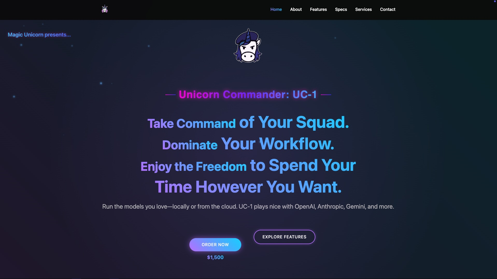

# Magic Unicorn Tech Website

A modern React website built with Vite, featuring responsive design and smooth animations.

## Website Preview



## Quick Start with Docker

### Prerequisites
- Docker
- Docker Compose

### Deploy with Single Command
```bash
# Make deploy script executable and run deployment
./deploy.sh

# For clean build (removes old images)
./deploy.sh --clean
```

Or manually with Docker Compose:
```bash
docker compose up --build -d
```

The site will be available at **http://localhost:7878**

### Stop the Application
```bash
docker compose down
```

### View Logs
```bash
docker compose logs -f
```

## Development

### Local Development
```bash
npm install
npm run dev
```

### Production Build
```bash
npm run build
npm run preview
```

## Project Structure

```
src/
├── components/     # Reusable React components
├── pages/         # Page components
├── styles/        # CSS modules and global styles
├── services/      # API services
├── hooks/         # Custom React hooks
├── images/        # Static images and assets
└── utils/         # Utility functions
```

## Tech Stack

- **React 18** - Frontend framework
- **Vite** - Build tool and dev server
- **Tailwind CSS** - Utility-first CSS framework
- **Framer Motion** - Animation library
- **React Router** - Client-side routing
- **Docker** - Containerization
- **Nginx** - Production web server
